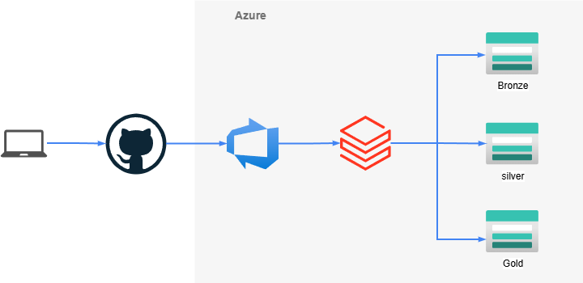
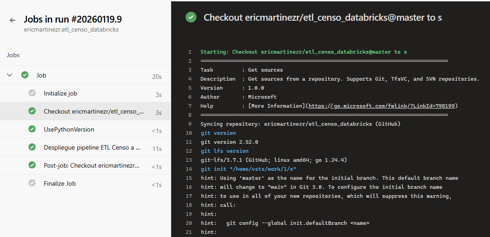
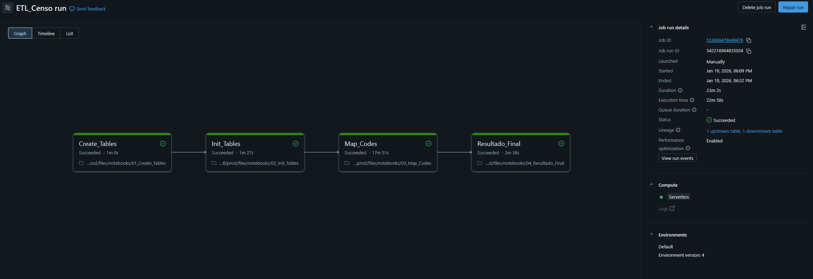
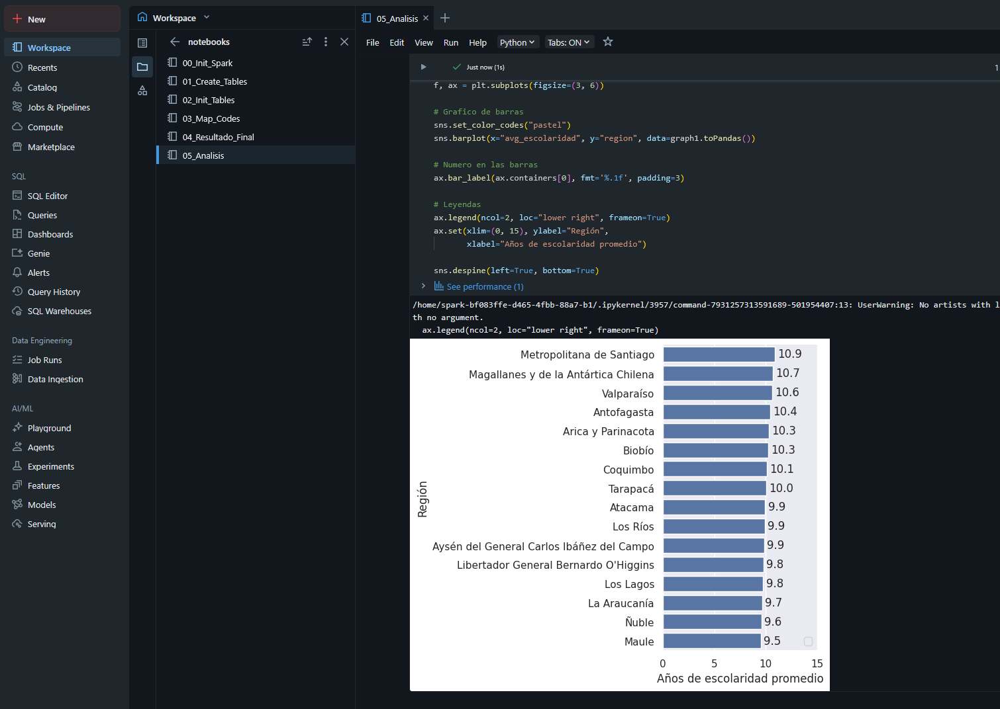
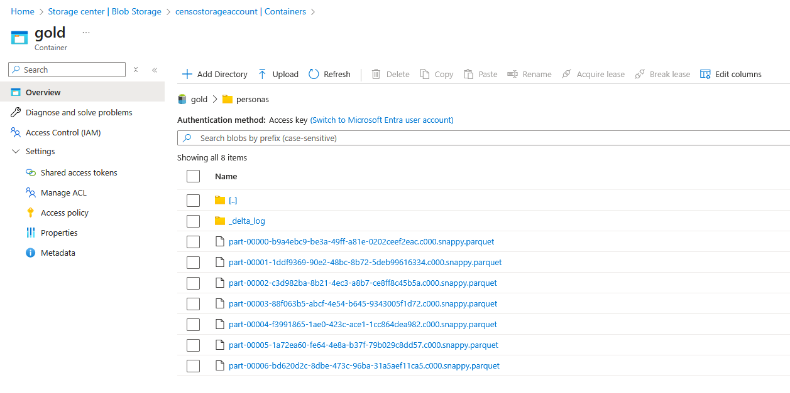

# ETL Censo Databricks

Proyecto de pipeline ETL para procesar datos del Censo 2024 en Azure Databricks.

Aprovechando que hace un tiempo se lanzó Databricks Free en lugar de Community Edition, decidí volver a mis orígenes y usar Databricks para revisar que tal se ve el ETL. Debo decir que Databricks Free me sorprendió y es muchísimo mejor que Community Edition.

También me permitió consumir todas las columnas del Censo 2024, que en Dataflow me tomaba mucho tiempo. Por eso retomé los mismos datos para probar esta herramienta.

Es probable que algún paso se me haya quedado en el aire, ya que no tengo mucha experiencia en los servicios de Azure.

## 1. Configuración de Azure

### 1.1. Crear Storage Account (ADLS Gen2)

Data Lake para almacenar datos en capas Bronze, Silver y Gold.

- **Crear Storage Account** en el portal de Azure.
- **Habilitar "Hierarchical namespace"** en la pestaña **Advanced** (fundamental para ADLS Gen2).
- **Crear contenedores**: Ir a `Containers` y generar:
  - `bronze`
  - `silver`
  - `gold`

### 1.2. Configurar Identidad y Permisos (Unity Catalog Access)

Conectar Databricks Unity Catalog al Storage mediante el Access Connector.

**Recurso Access Connector:**

- **ID del recurso**: `/subscriptions/9e4f111c-3ff5-49bc-84d0-6a7daf3f206e/resourceGroups/databricks-rg-censo-workspace-ysff7bvx6c3jk/providers/Microsoft.Databricks/accessConnectors/unity-catalog-access-connector`
  > _Nota: Este es el conector generado automáticamente por Databricks._

**Asignar Permisos:**

- Ir al **Storage Account** creado > **Access control (IAM)**.
- Seleccionar **Add role assignment**.
- **Rol**: Elegir `Storage Blob Data Contributor` (necesario para lectura/escritura de datos).
- **Miembros**:
  - Seleccionar **Managed identity**.
  - Buscar y seleccionar el recurso **Access Connector** indicado arriba.
- Confirmar y asignar.

---

## 2. Configuración de Databricks (Unity Catalog)

Vincular el Storage Account con Unity Catalog.

### 2.1. Crear Storage Credential

- Ir a **Catalog** en el workspace de Databricks.
- **Crear Credencial**: `+ Add` > `Storage credential`.
- **Nombre**: Usar algo descriptivo (ej. `censo_storage_credential`).
- **Access connector ID**: Copiar y pegar el ID del recurso del paso 1.2.
- Guardar.

### 2.2. Crear Ubicaciones Externas (External Locations)

Repetir para cada capa (`bronze`, `silver`, `gold`).

- Ir a **Catalog** > `+ Add` > `External location`.
- **Nombre**: `bronze`, `silver`, `gold`.
- **URL**: Usar el formato ABFS:
  - `abfss://<container>@<storage_account>.dfs.core.windows.net/`
  - _Ejemplo_: `abfss://bronze@censostorageaccount.dfs.core.windows.net`
    > _Nota: Ver locations de tablas en 01_Create_Tables_
- **Storage credential**: Seleccionar la credencial creada en 2.1.
- Crear.

---

## 3. Configuración de Azure DevOps

Automatizar el despliegue con CI/CD.

### 3.1. Crear Variable Group

- Ir a **Pipelines** > **Library**.
- **Crear grupo**: `+ Variable group`.
- **Nombre**: `databricks-prod-secrets` (Debe coincidir con `azure-pipelines.yml`).
- **Variables**:
  - `DATABRICKS_HOST`: URL del workspace (ej. `https://adb-xxxx.xx.azuredatabricks.net`).
  - `DATABRICKS_TOKEN`: Generar en Databricks (Settings > Developer > Access tokens).
- Guardar.

### 3.2. Crear el Pipeline

- Ir a **Pipelines** > **New pipeline**.
- **Connect**: Seleccionar GitHub y este repositorio.
- **Configure**: Elegir **Existing Azure Pipelines YAML file**.
- **Path**: Seleccionar `azure-pipelines.yml` en rama `master`.
- **Run**: Ejecutar para validar.

---

## 4. Carga de Datos Iniciales

Antes de ejecutar el proceso ETL, es necesario asegurar la disponibilidad de los archivos fuente.

- **Verificar ruta**: Asegurar que existe el volumen `/Volumes/censo_workspace/bronze/original/` (dentro del esquema bronze).
- **Cargar archivos**: Subir los siguientes archivos a esa ruta:
  - `hogares_censo2024.parquet`
  - `personas_censo2024.parquet`
  - `viviendas_censo2024.parquet`
  - `codigos_otros_v2.csv`
  - `codigos_territoriales.csv`
  - `codigos_territoriales_especificos.csv`

---

## 5. Ejecución del Job

El pipeline despliega el Job definido en `databricks.yml`.

- Ir a Databricks > **Jobs & Pipelines**.
- Buscar el Job desplegado (`ETL_Censo`).
- Ejecutar manualmente con **Run now**.

---

## Diagrama

---

## Imágenes de ejecución

### Azure DevOps

### Azure Databricks

Imagen del pipeline terminado.

Solo ejecuta 4 de los 6 notebook, ya que el primero solo funciona como un script de inicialización y el último es un notebook de análisis.

Esta imagen es de un notebook que no es parte del pipeline pero que se puede ejecutar posteriormente para hacer análisis y otros

### Azure Storage

Una imagen de muestra del contenido del storage luego de la ejecución del pipeline.

